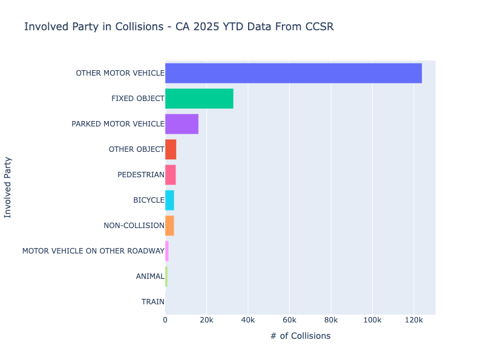
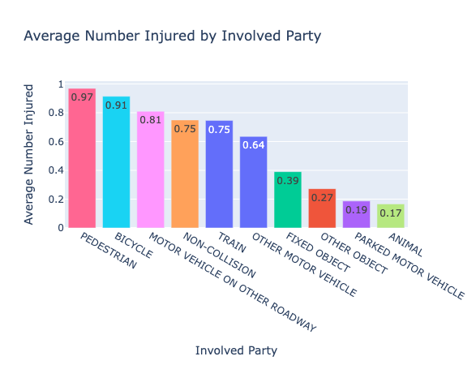
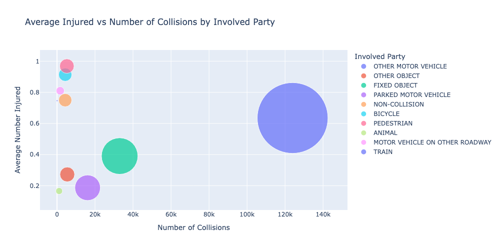
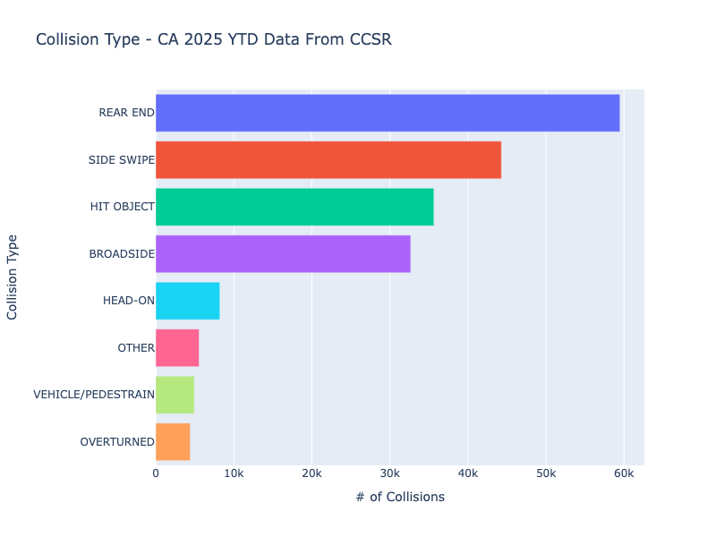
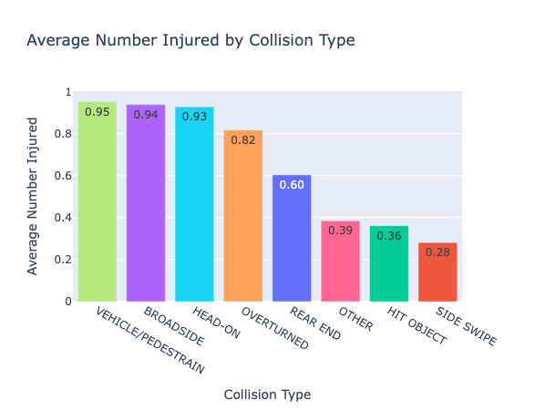
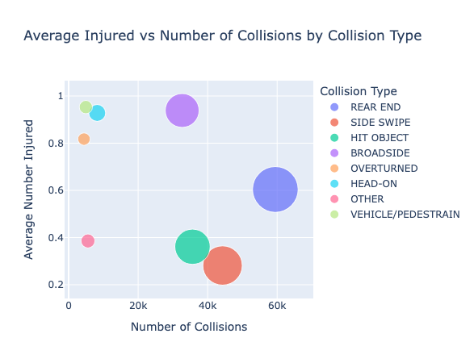

# California Crash Analysis (EDA)
Exploratory data analysis of California’s 2025 YTD crash dataset from California Crash Reporting System (CCRS), using Python (pandas, numpy, plotly).

## Objective

Analyze how different collision types and involved parties impact:
- Frequency (how often crashes occur)
- Severity (injuries per crash)

**Data Source:** [California Crash Reporting System (CCRS)](https://data.ca.gov/dataset/ccrs)

## Data Cleaning
- Standardized column names and reviewed data types and shape
- Removed columns with >70% missing values and irrelevant fields
- Verified `Collision_id` as a unique identifier
- Checked redundancy between `IsHighwayRelated` and `IsFreeway`
- Handled missing values and ensured dataset integrity

## Key Insights

- Pedestrian crashes are highly severe relative to their frequency
- Broadside collisions combine high frequency and high severity
- Rear-end collisions are most common but less severe

## EDA and Visualizations
Explore **frequency** (how often collisions occur) and **severity** (how many people are injured) across **involved party type** and **collision type**.

### Involved Party 
- **Frequency** – Other motor vehicles dominate, followed by fixed objects and parked vehicles.  
  

- **Severity** – Pedestrian and bicycle crashes have the highest average injuries.  
  

- **Frequency vs Severity** – Pedestrian crashes combine **high severity** with **top 5 frequency**.  
  

### Collision Type Analysis
- **Frequency** – Rear-end is most common, followed by side swipe, hit object, and broadside.  
  

- **Severity** – Vehicle–pedestrian, broadside, head-on, and overturned are most dangerous.  
  

- **Frequency vs Severity** – Broadsides combine **high frequency** and **high severity**, making this an especially concerning collision type.  
  

## How to Run

1. Install dependencies: `pip install -r requirements.txt`  
2. Download dataset from CCRS and save as `crashes_dataset.csv`  
3. Run notebook
